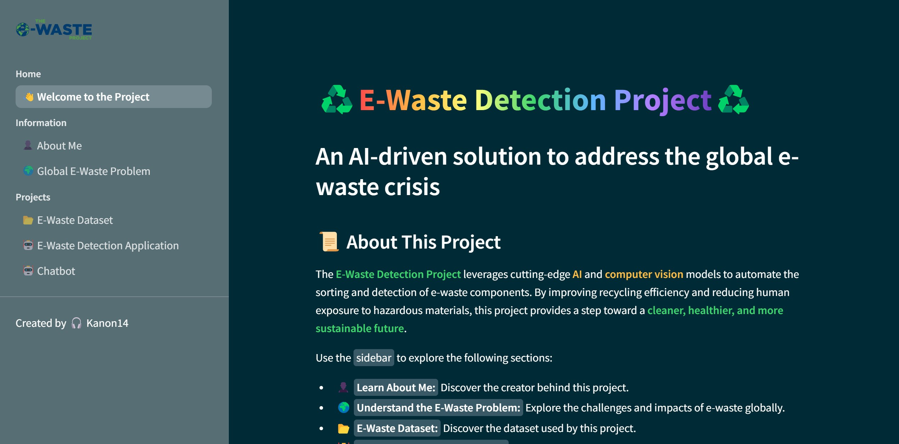

# 🤖 E-Waste Detection Project ♻️

## Project Overview
The <font color='lightgreen'>**E-Waste Detection Application**</font> aims to automate the sorting and detection of e-waste components using YOLO-based object detection models. By improving recycling efficiency and reducing human exposure to hazardous materials, this project provides a significant step toward a cleaner, healthier, and more sustainable future.

This repository includes a curated dataset, a multi-functional Streamlit web application, and an AI-powered chatbot for real-time interaction.

## Features
1. **E-Waste Problem Awareness**
    - Learn about the global e-waste crisis through detailed visualizations and informative content.
    - Understand the environmental and health impacts of improper e-waste management.
2. **Curated E-Waste Dataset**
    - **Dataset Size**: 10,000 images, annotated with 20 distinct classes such as *batteries, laptops, keyboards, fans, and more*.
    - **Format**: Images in `.jpg`, `.jpeg` and `.png` with YOLO-compatible annotations.
    - **Source**: Curated images from online repositories, synthetic data generation, and manual annotations.
    - **Access**: Publicly available in [Capstone-Kanon-2](https://universe.roboflow.com/computer-vision-learning-touhj/capstone-kanon-2) through the [Roboflow](https://roboflow.com/).
3. **E-Waste Detection Application**
    - Train the detection model directly within the app. 
    - Upload images or use live video feeds (webcam or IP webcam) for detection.
    - Visualize results with bounding boxes, class labels, and FPS metrics.
4. **Chatbot (Wall-E)**
    - AI-powered chatbot capable of answering e-waste-related questions in real time.
    - Powered by Llama3.2, allowing dynamic, conversational interactions.

## Project Setup
### Prerequisites
- Python 3.10+
- PyTorch Cuda 1.8+ [[Download PyTorch Cuda](https://pytorch.org/)]
- Compatible cuda toolkit and cudnn installed on your machine [[Nvidia GPU Capability](https://developer.nvidia.com/cuda-gpus)] [[Download Cuda Toolkit](https://developer.nvidia.com/cuda-toolkit)] (Note: You must have a [Nvidia Developer Account](https://developer.nvidia.com/login))
- Anaconda or Miniconda installed on your machine [[Download Anaconda](https://www.anaconda.com/download)]
- An ollama installed on your machine [[Download Ollama](https://ollama.com/download)]
- Install LLM model compatible with your machine, information can be found in [[Ollama GitHub](https://github.com/ollama/ollama)]


### Installation
1. **Clone the repository:**
```bash
git clone https://github.com/Kanon14/e-waste-classification-capstone.git
cd e-waste-classification-capstone
```

2. **Create and activate a Conda environment:**
```bash
conda create -n ewaste python=3.10 -y
conda activate ewaste
```

3. **Install dependencies:**
```bash
pip install -r requirements.txt
```

4. **Installing required ollama model:**
```bash
ollama pull llama3.2
```

## Workflow
The project workflow is designed to facilitate a seamless transition from development to deployment:
1. `constants`: Manage all fixed variables and paths used across the project.
2. `entity`: Define the data structures for handling inputs and outputs within the system.
3. `components`: Include all modular parts of the project such as data preprocessing, model training, and inference modules.
4. `pipelines`: Organize the sequence of operations from data ingestion to the final predictions.
5. `application`: This is the main executable script that ties all other components together and runs the whole pipeline.

## How to Run
1. **Execute the project:**
```bash
streamlit run streamlit_app.py
```
2. **Then, access the application via your web browser:**
```bash
open http://localhost:<port>
```

3. **Streamlit Application Structure:**

- `Homepage:` Introduction to the project and navigation instructions.
- `About Me:` Details about the developer's background and motivation.
- `Global E-Waste Problem:` Insights into the environmental impacts of e-waste.
- `E-Waste Dataset:` Dataset details, distribution, and download link.
- `E-Waste Detection Application:` Real-time object detection with images and live video feeds.
- `Chatbot:` AI-powered assistant to answer questions and guide users.

## Future Enhancements
- Integration with edge devices for real-time deployment.
- Advanced chatbot capabilities with multimodal inputs (text + images).
- Extension of the dataset with more diverse e-waste categories.

## Acknowledgements
- **Robotflow:** For dataset hosting and augmentation tools.
- **Ultralytics:** For the YOLO object detection framework.
- **Ollama:** For enabling the conversational AI assistant.